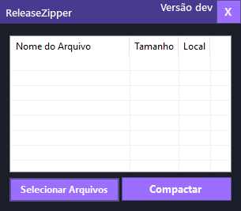

# Release Zipper 📦

Um utilitário Windows simples e moderno para selecionar múltiplos arquivos e compactá-los rapidamente em um arquivo `.zip`. Desenvolvido em C# com Windows Forms, focado em performance e usabilidade.

---

## Features 🚀

* **Seleção Múltipla de Arquivos:** Interface nativa para selecionar diversos arquivos de múltiplas fontes.
* **Visualização Detalhada:** `ListView` exibe nome, tamanho formatado (KB, MB) e caminho de cada arquivo.
* **Compactação Direta:** Cria o arquivo `release.zip` na Área de Trabalho com um único clique.
* **UI Customizada:** Janela sem bordas com suporte a drag-and-drop via P/Invoke (`user32.dll`).
* **Tratamento de Erros:** Notificações claras em caso de falhas durante a compactação.

---

## Quick Start 📝

1.  Execute `ReleaseZipper.exe`.
2.  Clique em **Selecionar Arquivos** e escolha os arquivos desejados.
3.  Clique em **Compactar**.
4.  O arquivo `release.zip` será gerado em seu Desktop.

---

## Roadmap 🔮

* [ ] **Salvar Onde Quiser:** Implementar `SaveFileDialog` para escolher local e nome do arquivo.
* [ ] **Remover da Lista:** Adicionar opção de remover itens selecionados da lista.
* [ ] **Barra de Progresso:** Feedback visual para a compactação de arquivos grandes.

---

Contribuições são bem-vindas!